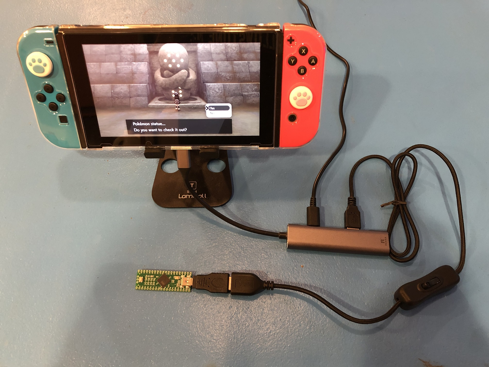

# Pokémon Automation - Microcontroller Programs

This repo contains the microcontroller-only programs (formerly known as "native programs") for Pokémon Automation.

[More information about this project.](https://github.com/PokemonAutomation/About/blob/master/README.md)

**As of March 2025, the microcontroller-only (MC) programs are deprecated.**

We recommend that check out our [Computer Control](https://github.com/PokemonAutomation/ComputerControl/blob/master/README.md) automation instead.

Otherwise, our microcontroller guide is still available here: [Microcontroller Setup Guide](Wiki/SetupGuide/README.md).

**Latest Downloads:**
- [See Releases](https://github.com/PokemonAutomation/Microcontroller/releases)

**Contents:**
- [Setup Guide](Wiki/SetupGuide/README.md)
- [Program List](Wiki/Programs/README.md)
  - [Nintendo Switch](Wiki/Programs/README.md#nintendo-switch)
  - [Pokémon Sword/Shield](Wiki/Programs/README.md#pokémon-swordshield)
  - [Pokémon Brilliant Diamond/Shining Pearl](Wiki/Programs/README.md#pokémon-brilliant-diamondshining-pearl)
  - [Pokémon Scarlet and Violet](Wiki/Programs/README.md#pokémon-scarlet-and-violet)
- [Version History](Wiki/VersionHistory.md)

## Microcontroller Automation

Entry-level automation of the Pokémon games. All you need is a tiny board and a USB cable!

