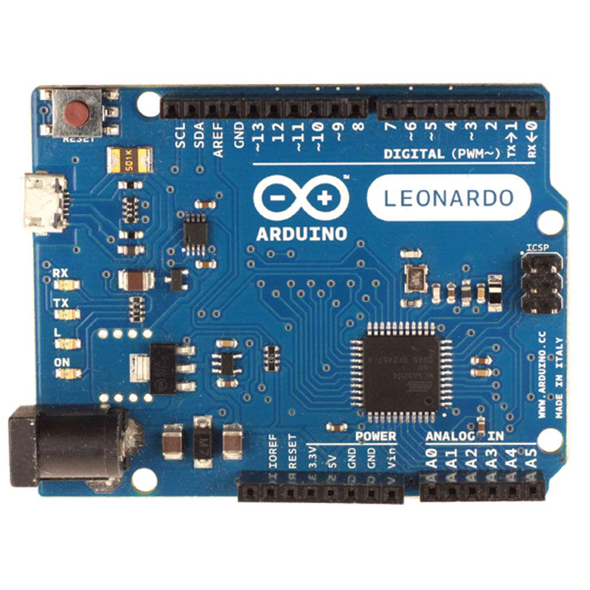

# Hardware - Arduino Leonardo

This section covers the required hardware for users who have chosen the Arduino Leonardo.

## Required Microcontroller Hardware

1. [Arduino Leonardo Board](https://www.amazon.com/gp/product/B0786LJQ8K)

2. If it doesn't come with the cable, you will need it separately. It is a Micro-USB male to USB-A male cable.

3. Switch Lite users will also need a USB hub or portable dock. ([example](https://www.amazon.com/gp/product/B07JK9DFKH))

> The Switch Lite does not have a USB-A port. Therefore you need either an adapter or a hub to connect the microcontroller. A charging hub or dock is required to simultaneously charge and use the microcontroller.
>
> Note: even on a dock, Switch Lite cannot output video over HDMI.

## Serial Hardware for Computer-Controlled Programs

If you only need microcontroller-only programs, skip this section.

1. Serial Board (**Pick one**)
   1. UART Cable ([CP210x controller](https://www.adafruit.com/product/954)) Adafruit UART cable is not the cheapest, but it is the most beginner-friendly.  
      ***DO NOT get the Prolific (PLxxxx) controllers.* They do not work and they are explicitly blocked in the program.**  They are cheap because they do not work. If you buy it anyway, you will be wasting your time and money.  **YOU HAVE BEEN WARNED!**  
   2. CP210x board ([4 for $8](https://www.amazon.com/gp/product/B07T1XR9FT)) | ([2 for $8](https://www.amazon.com/gp/product/B07D6LLX19/)) | ([1 for $8](https://www.amazon.com/dp/B072K3Z3TL))
      >  If you are experienced (or confident), these are some cheaper alternatives which also work. These may require a trivial amount of extra wiring.
2. Jumper Wires ([example](https://www.amazon.com/dp/B07GD2BWPY))

## Next Steps

Continue to the rest of [hardware tutorial](Hardware.md).

**Discord Server:** 

