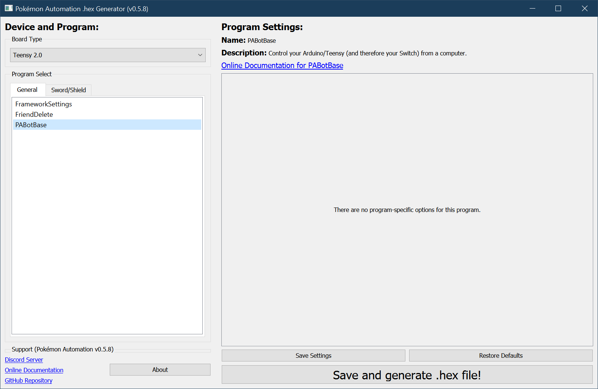

# PABotBase

Pokémon Automation Bot Base (PABotBase) is the program used by all the [advanced programs](https://github.com/PokemonAutomation/SwSh-Arduino/wiki/Programs:-Advanced-List).

You shouldn't have to compile this program yourself since the SerialPrograms package has this pre-compiled.

**Discord Server:** 

