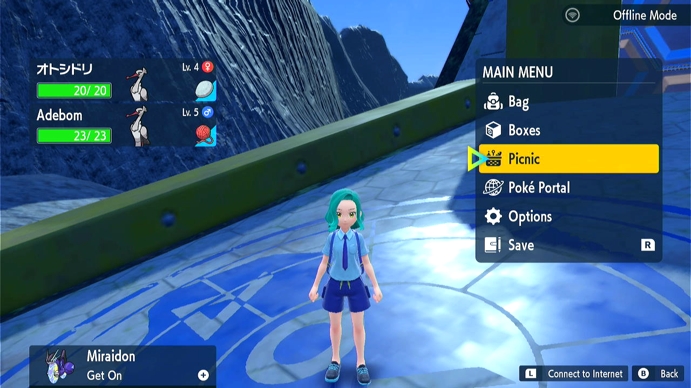

# Egg Combined

**Related Programs:**
- **Microcontroller:** [Egg Combined](https://github.com/PokemonAutomation/Microcontroller/blob/master/Wiki/Programs/PokemonSV/EggCombined.md) (this program)
- **Microcontroller:** [Egg Hatcher](https://github.com/PokemonAutomation/Microcontroller/blob/master/Wiki/Programs/PokemonSV/EggHatcher.md)
- **Microcontroller:** [Egg Fetcher](https://github.com/PokemonAutomation/Microcontroller/blob/master/Wiki/Programs/PokemonSV/EggFetcher.md)
- **Computer Control:** [Egg Fetcher](https://github.com/PokemonAutomation/ComputerControl/blob/master/Wiki/Programs/PokemonSV/EggFetcher.md)
- **Computer Control:** [Egg Hatcher](https://github.com/PokemonAutomation/ComputerControl/blob/master/Wiki/Programs/PokemonSV/EggHatcher.md)
- **Computer Control:** [Egg Autonmous](https://github.com/PokemonAutomation/ComputerControl/blob/master/Wiki/Programs/PokemonSV/EggAutonomous.md)

The microcontroller and computer-control versions of this program are conceptually similar.

## Program Description

Collect eggs in picnic by making X sandwiches, then hatch Y boxes of eggs.

## Safety Precautions

Scarlet & Violet is known to drop button inputs, it is not recommended to make more than 7 sandwiches and/or hatch more than 10 boxes in 1 run. Put your console in airplane mode to prevent accidentally going online.

### Setup of Settings

1. Text Speed: Fast
2. Send to box: Auto
3. Nickname: Off

### Ingredient Setup

1. Have sufficient Ham and Butter to make the sandwiches (Sweet Herba Mystica as well if selected).
2. If using Sweet Herba Mystica, have Recipe #3 unlocked (given by NPC in most sandwich shops).

### Box Setup

1. Place a Flame Body or similar Pokemon to the first slot in the box to the left of the initial egg collection box. Parents will be deposited in this box after sandwich making.

### Instructions

1. You are at the position right after flying to Zero Gate.
2. Cursor must be on Picnic when opening the menu.
   
3. Start the program in change grip menu.

## Options

Use Sweet Herba Mystica:
- **Yes:** Egg Power 2 (1 Ham + 1 Butter + 1 Sweet Herba Mystica)
- **No:** Egg Power 1 (1 Ham + 1 Butter)

Maximum amount of sandwiches to make: The maximum amount of sandwiches the program should make.

Boxes to Hatch: Select number of boxes to hatch. The optimal ratio of sandwich to box is about 2:3 for Egg Power 1 and 1:2 for Egg Power 2.

Step Count: The number of steps needed to hatch the eggs. Look up the value on Serebii.

Has cloned rider: Check this box if you have a cloned rider in your 2nd party slot.

## Advanced Options

Safety Coefficient: If you note that the program prematurely moves to the next column of eggs frequently, increasing the number will extend the hatching time per cycle.

## Credits

- **Author:** Nymphea

**Discord Server:** 

