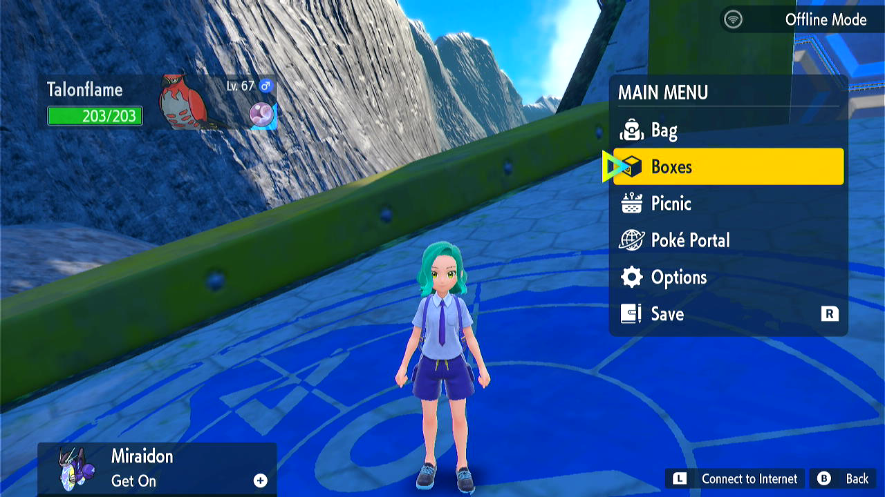

# Egg Fetcher

**Related Programs:**
- **Microcontroller:** [Egg Hatcher](https://github.com/PokemonAutomation/Microcontroller/blob/master/Wiki/Programs/PokemonSV/EggHatcher.md) (this program)
- **Microcontroller:** [Egg Fetcher](https://github.com/PokemonAutomation/Microcontroller/blob/master/Wiki/Programs/PokemonSV/EggFetcher.md)
- **Computer Control:** [Egg Fetcher](https://github.com/PokemonAutomation/ComputerControl/blob/master/Wiki/Programs/PokemonSV/EggFetcher.md)
- **Computer Control:** [Egg Hatcher](https://github.com/PokemonAutomation/ComputerControl/blob/master/Wiki/Programs/PokemonSV/EggHatcher.md)
- **Computer Control:** [Egg Autonmous](https://github.com/PokemonAutomation/ComputerControl/blob/master/Wiki/Programs/PokemonSV/EggAutonomous.md)

The microcontroller and computer-control versions of this program are functionally identical.

## Program Description

Hatch eggs from box at Zero Gate.

## Safety Precautions

Scarlet & Violet is known to drop button inputs, it is not recommended to hatch more than 10 boxes in 1 run. Put your console in airplane mode to prevent accidentally going online.

### Setup of Settings

1. Text Speed: Fast
2. Send to box: Auto
3. Nickname: Off

### Party Setup

1. Without cloned rider: Your party must have only 1 Flame Body (or similar) Pokemon
2. With cloned rider: Your party must have only 2 Pokemon, the Flame Body (or similar) Pokemon in lead with cloned rider in 2nd party slot.

### Box Setup

1. Place entire boxes filled with Eggs consecutively. It is okay to have non-Eggs mixed in with eggs. The only requirement is that each column has at least 1 Pokemon/Egg.
2. You must be on the first box of Eggs.
3. Cursor must be on Boxes when opening the menu.
   

### Instructions

1. You are at the position right after flying to Zero Gate.
2. Start the program in change grip menu.

## Options

Boxes to Hatch: Select number of boxes to hatch.

Step Count: The number of steps needed to hatch the eggs. Look up the value on Serebii.

Has cloned rider: Check this box if you have a cloned rider in your 2nd party slot.

## Advanced Options

Safety Coefficient: If you note that the program prematurely moves to the next column of eggs frequently, increasing the number will extend the hatching time per cycle.

## Credits

- **Author:** Nymphea

**Discord Server:** 

