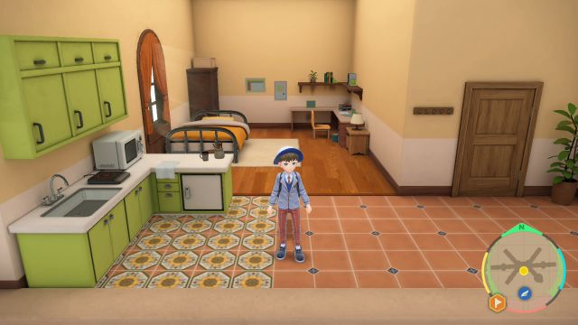

# Item Dupe

**Related Programs:**
- **Microcontroller:** [Item Dupe](https://github.com/PokemonAutomation/Microcontroller/blob/master/Wiki/Programs/PokemonSV/ItemDupe.md) (this program)
- **Computer Control:** [Clone Items](https://github.com/PokemonAutomation/ComputerControl/blob/master/Wiki/Programs/PokemonSV/CloneItems-101.md)

The microcontroller and computer-control versions of this program are functionally identical.

## Program Description

Autonomously Duplicate x999 Items in ~6 hours. This program will automatically fix any errors so it can run without supervision!

### Setup of Settings

1. Text Speed: Fast
2. Legendary Clone in Part Slot 1
3. Dupe Glitch Activated
4. Cursor at Box 1 Slot 1

**Strongly Recommended:**
- Being Indoors to prevent errors

### Instructions

1. Your party is full and Legendary is in slot 1
2. You are in a place where wild pokemon won't attack
3. Start the program in the [Change Grip/Order Menu](/Wiki/Programs/NintendoSwitch/ChangeGripOrderMenu.md).

## Options

None

## Credits

- **Author:** Vaedz7

**Discord Server:** 

