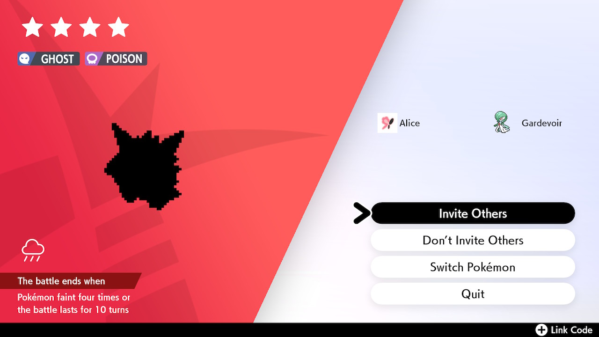
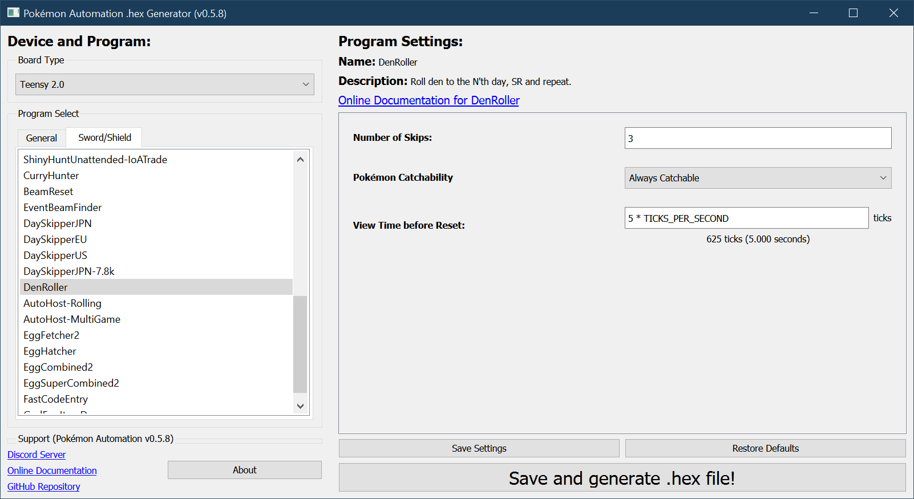

# Den Roller

**Related Programs:**
- **Microcontroller:** [Den Roller](https://github.com/PokemonAutomation/Microcontroller/blob/master/Wiki/Programs/PokemonSwSh/DenRoller.md) (this program)
- **Computer Control:** [Den Roller](https://github.com/PokemonAutomation/ComputerControl/blob/master/Wiki/Programs/PokemonSwSh/DenRoller.md)

While this program exists for both microcontroller and computer-control, the latter provides substantial improvements over the former.

The computer-control den roller can read the sprite of the den Pokémon and automatically stop on what you want.

## Program Description

Roll a den forward by N days, show what it is, then reset.

Use this program to roll for a specific Pokémon in your den.

### Setup of Settings

1. Text Speed: Fast
2. Casual mode: Off
3. System time: Un-synced

> *If starting the game requires checking the internet (because it is digital on a non-primary Switch), you will need to open up `PokemonSettings.c` and change `START_GAME_REQUIRES_INTERNET` to true.*

### Instructions

1. Stand in front of a wishing piece den with watts collected.
   1. Your location should be safe from getting attacked by wild Pokémon.
2. Save.
3. Return to the overworld (not in a menu).
4. Start the program in the [Change Grip/Order Menu](/Wiki/Programs/NintendoSwitch/ChangeGripOrderMenu.md).

## Options

This program uses [`TOLERATE_SYSTEM_UPDATE_MENU_FAST`](/Wiki/Programs/NintendoSwitch/FrameworkSettings.md#tolerate-system-update-menu-fast) to bypass the system update window.

### Frame Skips:

The number of frames to roll. The default is 3. But some people may prefer to save high-value dens more than 3 days back for added safety in case of accidental roll-over.

### Catchability:

Some dens have uncatchable Pokémon (i.e. Mewtwo or Zeraora). If the den has any such uncatchable Pokémon, you must this to `Maybe Uncatchable`.

### Delay Before Reset:

View the rolled Pokémon for this long before resetting.

**Discord Server:** 

