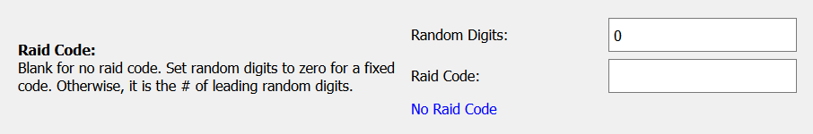
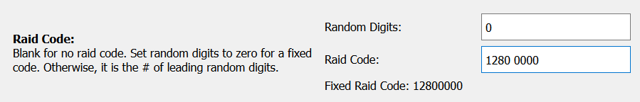
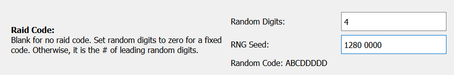

# Raid Code

This option is used by all the auto-hosts.

### No Code (FFA)

### Fixed Code

This will always use the code "12800000" for every raid.

Notes:
- The program will skip non-digit characters. So the space or hyphen separator is optional.

### Random Code

In this example, it will randomize the first 4 digits of the raid code. The remaining digits will be copies of the 4th digit.

For example: "12344444", "78966666", etc... The purpose of repeating the last digit is to make it easier for raiders to enter the code.

When using a random raid code, the **Raid Code** box is used to generate a starting seed for the RNG. RNG seeding is needed for microcontrollers because they have almost no source of entropy to generate high quality random numbers.

If you don't know what that means, just ignore it and leave it as is.

**Discord Server:** 

