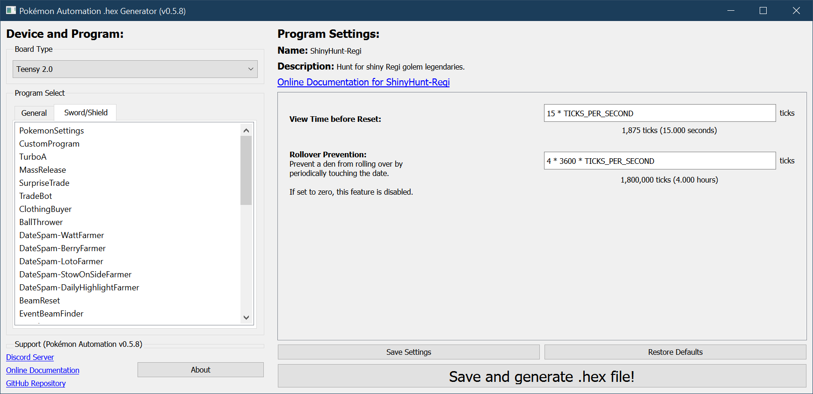

# Shiny Hunt: Regi

**Related Programs:**
- **Microcontroller:** [Shiny Hunt: Regi](https://github.com/PokemonAutomation/Microcontroller/blob/master/Wiki/Programs/PokemonSwSh/ShinyHunt-Regi.md) (this program)
- **Microcontroller:** [Shiny Hunt Unattended: Regi](https://github.com/PokemonAutomation/Microcontroller/blob/master/Wiki/Programs/PokemonSwSh/ShinyHuntUnattended-Regi.md)
- **Computer Control:** [Shiny Hunt Unattended: Regi](https://github.com/PokemonAutomation/ComputerControl/blob/master/Wiki/Programs/PokemonSwSh/ShinyHuntUnattended-Regi.md)
- **Computer Control:** [Shiny Hunt Autonomous: Regi](https://github.com/PokemonAutomation/ComputerControl/blob/master/Wiki/Programs/PokemonSwSh/ShinyHuntAutonomous-Regi.md)

The "Unattended" versions are functionally identical between the microcontroller and computer-control versions.

The last one on the list is the most advanced. It can detect shinies, distinguish stars from squares, stop on them, and notify the user.

## Program Description

Soft-reset for a shiny Regi golem. This program requires you to watch it since it won't stop on a shiny.

### Setup of Settings

1. Text Speed: Fast
2. Casual mode: Off
3. System time: Un-synced
4. You must have 7 or more badges or you cannot catch the Regi.

### Instructions

1. You must be standing in front of and facing the Regi statue with the lights activated.
2. Save in the above position.
3. Start the program in the [Change Grip/Order Menu](/Wiki/Programs/NintendoSwitch/ChangeGripOrderMenu.md).

   > Additional Recommendations: Make sure your lead Pokémon is not shiny. That way if you hear the shiny sound, you know it's the Regi and not your own lead Pokémon.

## Options

This program uses [**Tolerate System Update Menu (fast)**](/Wiki/Programs/NintendoSwitch/FrameworkSettings.md#tolerate-system-update-menu-fast) to bypass the system update window.

### Wait Time: 

Wait this long after initiating the battle before resetting.

## Advanced Settings:

These are advanced settings. You shouldn't need to touch these unless something isn't working and you're trying to debug it yourself.

### Rollover Prevention:

This is useful if your game is holding a den and you do not want an unintentional date-skip to destroy it.

Prevent the den from rolling over by periodically touching the date at this interval. Set this value to zero to disable the feature.

**Discord Server:** 

