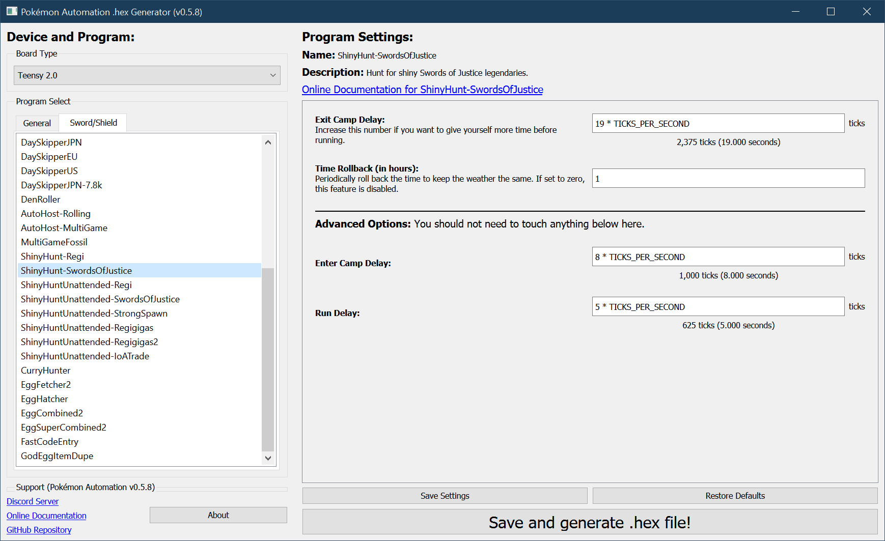

# Shiny Hunt: Swords of Justice

**Related Programs:**
- **Microcontroller:** [Shiny Hunt: Swords of Justice](https://github.com/PokemonAutomation/Microcontroller/blob/master/Wiki/Programs/PokemonSwSh/ShinyHunt-SwordsOfJustice.md) (this program)
- **Microcontroller:** [Shiny Hunt Unattended: Swords of Justice](https://github.com/PokemonAutomation/Microcontroller/blob/master/Wiki/Programs/PokemonSwSh/ShinyHuntUnattended-SwordsOfJustice.md)
- **Computer Control:** [Shiny Hunt Unattended: Swords of Justice](https://github.com/PokemonAutomation/ComputerControl/blob/master/Wiki/Programs/PokemonSwSh/ShinyHuntUnattended-SwordsOfJustice.md)
- **Computer Control:** [Shiny Hunt Autonomous: Swords of Justice](https://github.com/PokemonAutomation/ComputerControl/blob/master/Wiki/Programs/PokemonSwSh/ShinyHuntAutonomous-SwordsOfJustice.md)

The "Unattended" versions are functionally identical between the microcontroller and computer-control versions.

The last one on the list is the most advanced. It can detect shinies, distinguish stars from squares, stop on them, and notify the user.

## Program Description

Soft-reset for a shiny Sword of Justice. This program requires you to watch it since it won't stop on a shiny.

### Setup of Settings

1. Text Speed: Fast
2. Casual mode: Off
3. System time: Un-synced
4. Airplane mode: Off

### Setup of Party

1. Your lead Pokémon must be faster than the Sword of Justice. (in order to run away)

> Additional Recommendations: Make sure your lead Pokémon is not shiny. That way if you hear the shiny sound, you know it's the Sword of Justice and not your own lead Pokémon.

### Instructions

1. You must have previously defeated or ran away from the Sword of Justice so that it is no longer present.
2. Stand exactly on the spawn point of the Sword of Justice
3. Open the menu and place the cursor over the "Pokémon Camp" option.
4. Press "B" to return to the overworld.
3. Start the program in the [Change Grip/Order Menu](/Wiki/Programs/NintendoSwitch/ChangeGripOrderMenu.md).

### SoJ Spawn Points

**Virizion Spawn Point:**

**Cobalion Spawn Point:**

**Terrakion Spawn Point:**

## Options

This program uses [**Tolerate System Update Menu (fast)**](/Wiki/Programs/NintendoSwitch/FrameworkSettings.md#tolerate-system-update-menu-fast) to bypass the system update window.

### Exit Camp to Run Delay:

This is the delay from when you leave the camp to when you run from the battle. Increase this if you want to give yourself more time to stop the program on a shiny.

### Time Rollback:

Every this many hours, rollback the time by this many hours. This keeps the time constant to prevent the weather from changing. It also allows you to target time-specific marks. Set this to zero to disable this feature.

This feature will also prevent any unintentional day-skips that will destroy any dens that are on the save file.

## Advanced Settings:

These are advanced settings. You shouldn't need to touch these unless something isn't working and you're trying to debug it yourself.

### Enter Camp Delay:

Wait this long after entering camp before you leave.

### Run Delay:

The delay from when you run from the battle to when you bring up the menu to enter the camp.

**Discord Server:** 

