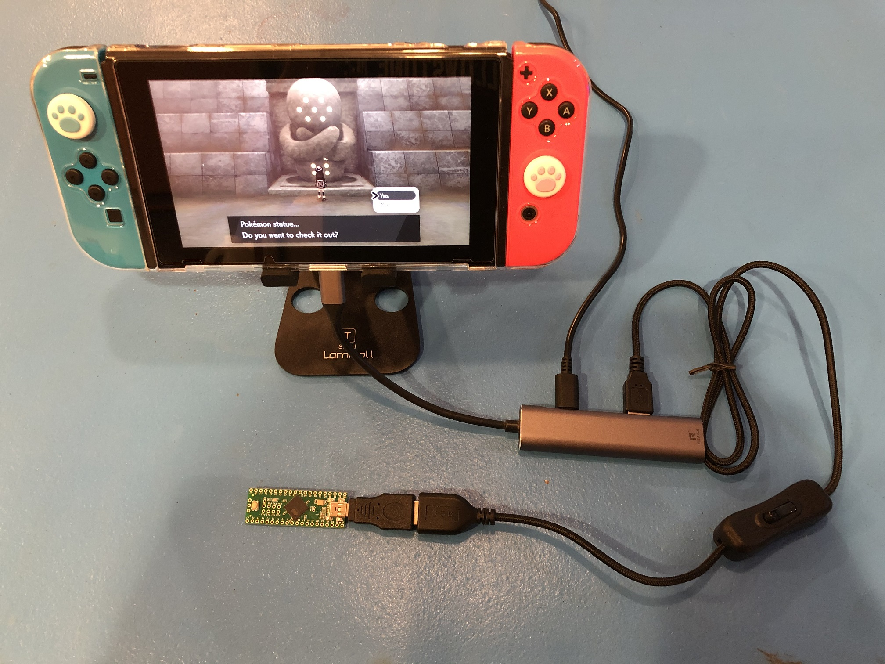
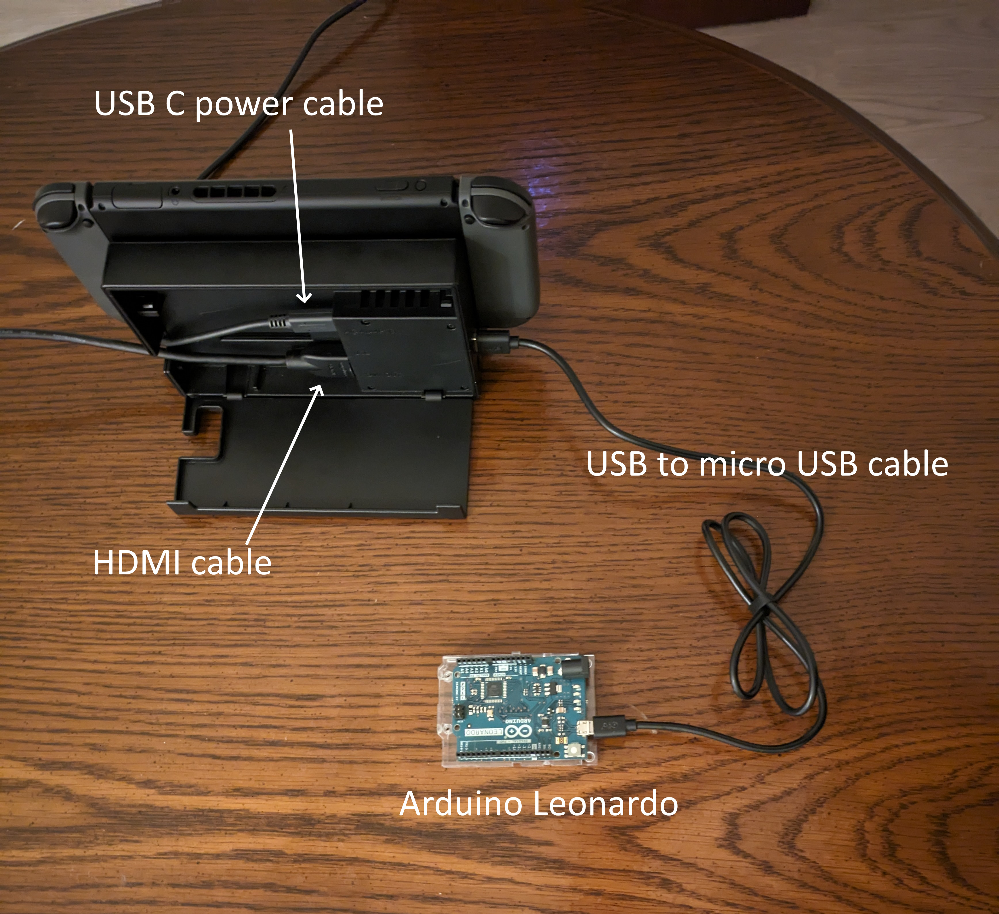
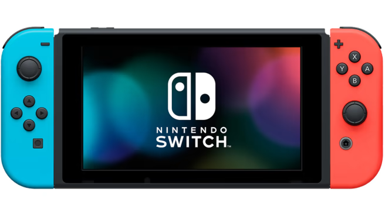
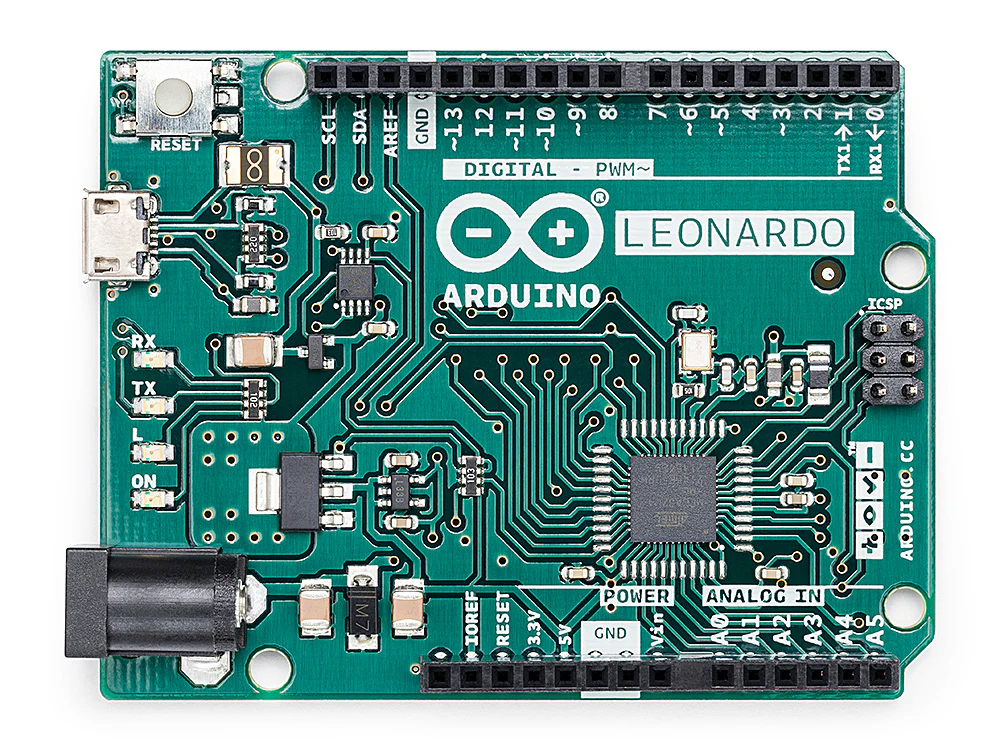
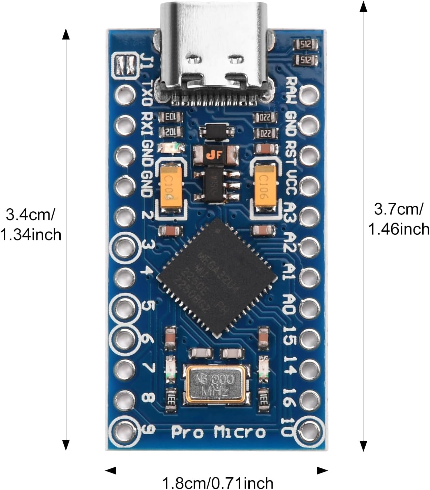
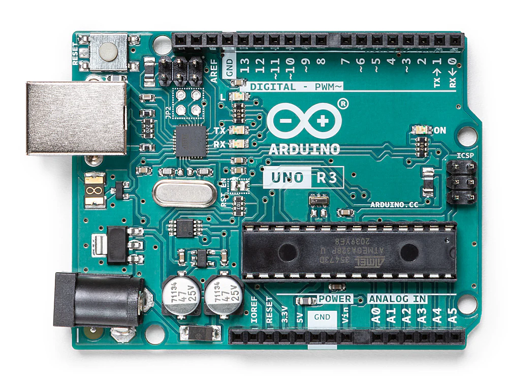
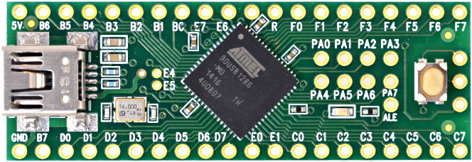

# Microcontroller (MC) Setup Guide

This guide will walk through how to setup Microcontroller automation.

Microcontroller automation is our old method which involves using only a micontroller. There is no feedback and no computer to control it. A computer is only used to program the micrcontroller.

**As of 2025, microcontroller (MC) automation is officially deprecated. It has not been updated or maintained for years as we have moved on to [Computer Control (CC) automation](https://github.com/PokemonAutomation/ComputerControl).**

**Furthermore, recent improvements to the setup for CC automation have made MC automation completely obsolete.**

Therefore this guide is only provided as supplemental information for our past setup.

The microcontroller (MC) automation setup consists of 2 main components:
1. A Nintendo Switch.
2. A microcontroller to control the Switch.

The microcontroller alone controls the Switch. And it does it by sending blind button presses at preprogrammed times.
A computer is needed to program the microcontroller.

 

## Step 1: Get the Hardware

### The Computer:

While a computer is not used during the automation, it is needed to program the microcontroller.

We support Windows, Mac, and Linux. However, Windows is preferred since we have a UI for it. If you choose Mac or Linux, you will need to use the command line.

### The Nintendo Switch

Obviously, automating a Nintendo Switch is going to require a Nintendo Switch.

You can use either a regular Switch or a Switch Lite. Unlike CC automation, video output is not required since the microcontroller can't see it anyway. So you can use a Switch Lite. (though it's worth noting that CC can still automate a Switch Lite if the program does not require video feedback)

### The Microcontroller:

There are many options here.

| **Arduino Leonardo** | **Pro Micro** | **Arduino Uno R3 (Legacy)** | **Teensy(++) 2.0 (discontinued)** |
| --- | --- | --- | --- |
|  |  |  |     |
| Easy to setup. Easy migration path to [Computer Control automation](https://github.com/PokemonAutomation/ComputerControl). | Cheapest in volume. Harder to setup. | Risky choice - not all models work. | Easiest to setup, but discontinued by manufacturer. Difficult migration path to [Computer Control automation](https://github.com/PokemonAutomation/ComputerControl). |
| Difficult to change programs. | Difficult to change programs. | Difficult to change programs. | Easy to change programs. |
| Recommended for beginners. | Recommended for experienced users only. | Not recommended at all due to various issues. Choose this only if you already have an Uno R3 sitting around. | By far the best microcontroller for MC automation for both beginners and experts. But not recommended due to being discontinued by the manufacturer. |

Each of these will require their associated USB cables to connecting to the computer to program and to the Switch to run.

## Step 2: Setup and Run

Each controller has its own setup:

- [Arduino Leonardo](Windows-ArduinoLeonardo.md)
- [Pro Micro](Windows-ProMicro.md)
- [Arduino Uno R3](Windows-ArduinoUnoR3.md)
- [Teensy 2.0 and Teensy++ 2.0](Windows-Teensy2.md)

If you are not using Windows, we have a Mac guide.

- [Mac (all microcontrollers)](Mac-AllControllers.md)

We do no have a Linux guide. But if you're using Linux, you can probably figure out what to do from this Mac guide.

**Discord Server:** 

