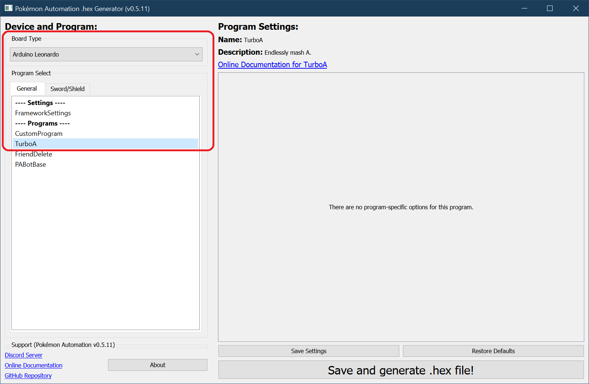
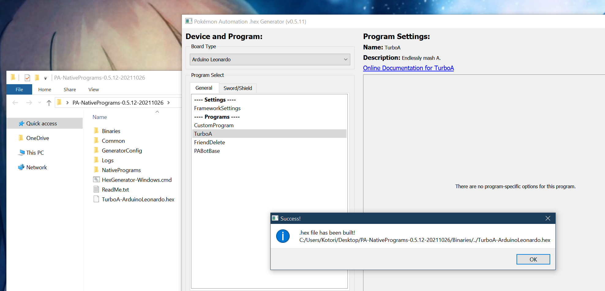
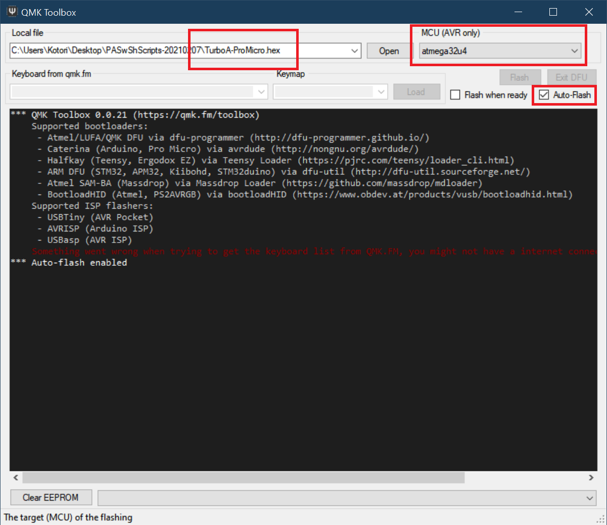
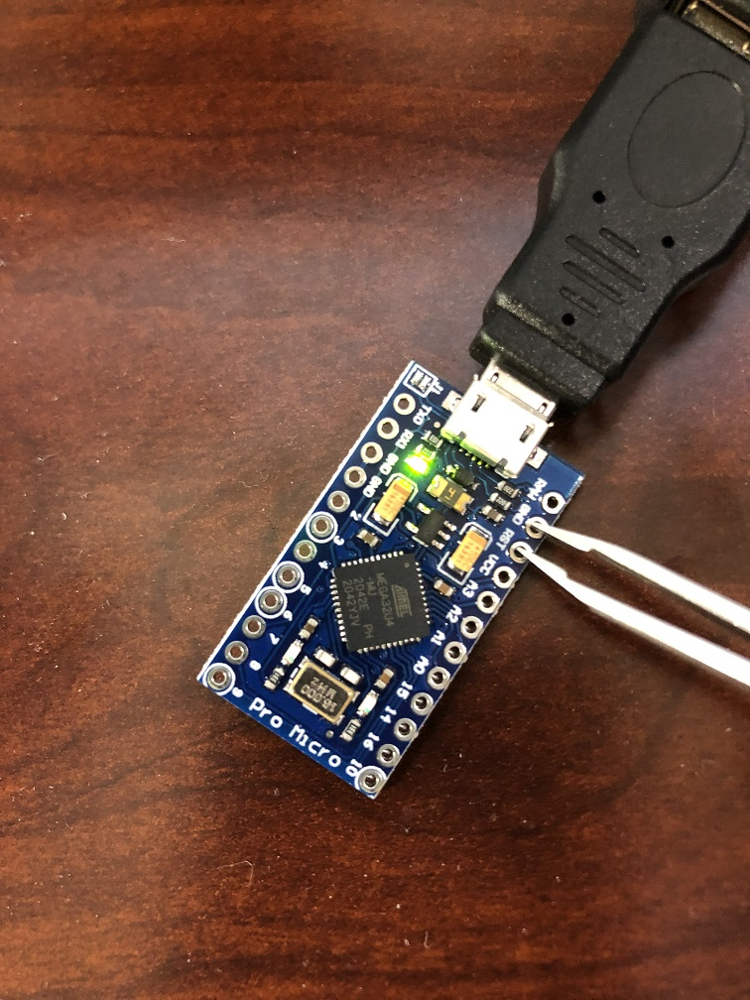
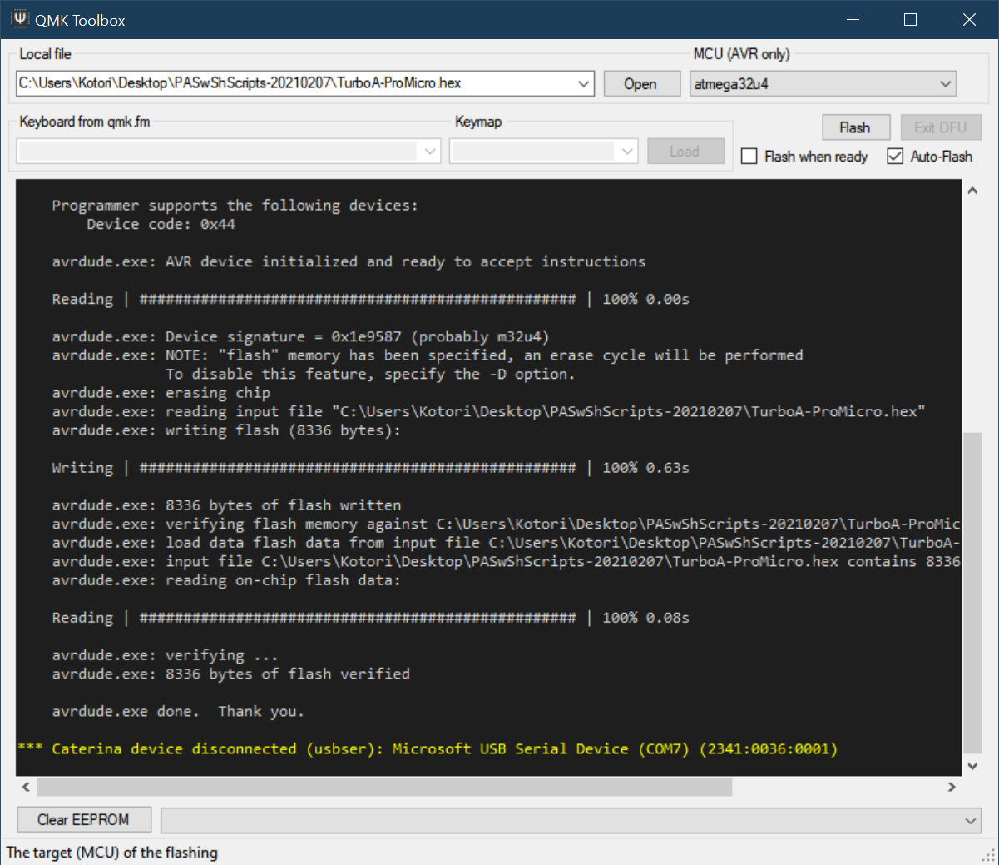
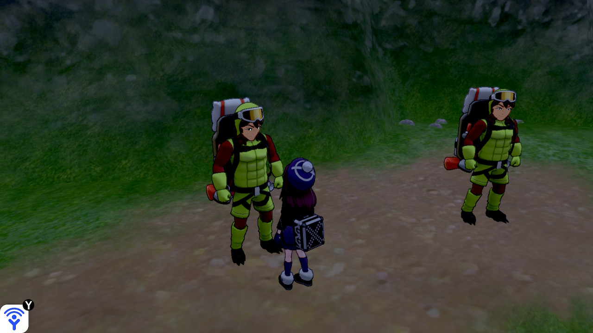
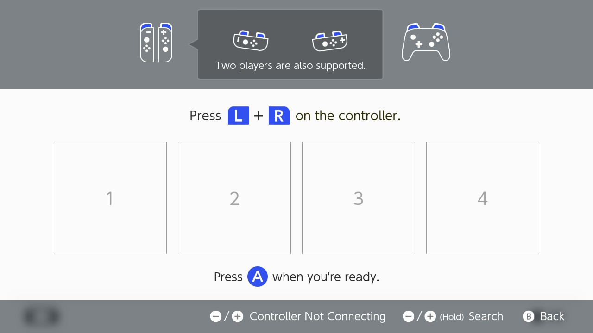

# Microcontroller Setup: Pro Micro (Windows)

This section will walk you through the entire process of setting up your Pro Micro on a Windows computer.

We do not recommend the Pro Mico for Microcontroller automation due to the difficulty of flashing it (requiring shorting pin holes).

However, for Computer Control automation (where you only need to flash once), it is the preferred microcontroller for experienced users who want a low-cost approach to automating multiple Switches simultaneously.

**Required Hardware (Full List):**
1. A Nintendo Switch.
2. A computer running Windows.
4. A Pro Micro microcontroller.
5. USB A to mini USB cable

### Recommended Purchase Links:

**Pro Micro:** https://www.amazon.com/gp/product/B08BJNV1J3

**USB A to micro USB cable:**
- https://www.amazon.com/Android-Compatible-Smartphones-Charging-Stations/dp/B095JZSHXQ

## Step 1: Install WinAVR

Download and install [WinAVR](https://sourceforge.net/projects/winavr/files/).

It is strongly recommended to install it in the default directory (`C:/WinAVR-20100110`).

## Step 2: Download QMK Toolbox

A few QMK versions are known to work. e.g. 0.1.1, 0.2.2, and 0.3.1. Other versions may not work (e.g. 0.3.2 does not work).

Download [QMK Toolbox](https://github.com/qmk/qmk_toolbox/releases). Ensure you download a version known to work. e.g. 0.3.1.

You want the file `qmk_toolbox.exe`. You'll find it under `Assets`, under the version number that you choose (e.g. 0.3.1).

## Step 3: Download the Arduino Programs

1. Download the latest version of our Arduino programs from [here](https://github.com/PokemonAutomation/Microcontroller/releases).

   * (The link should look like something like `PA-NativePrograms-0.x.x-xxxxxxxx.zip`)

   * If you get a virus or malware warning, ignore it. These are known false positives. If you don't trust us, the [source code is here](https://github.com/PokemonAutomation/Arduino-Source/tree/main/HexGenerator).

2. Once you have downloaded the package, unzip to somewhere you can access later. Do not put it on Microsoft OneDrive.

## Step 4: Generate a .hex file.

1. Open the (unzipped) package from previous step and double-click on `HexGenerator-Windows.cmd` to run it.
2. In the "Board Type" drop-down, change it to "Pro Micro".
3. In the program list, click on "Turbo A".
> We recommend starting with "Turbo A"  as it is the simplest program. If you are able to get this running, it is easier to troubleshoot the other programs.

4. Click on "Save and generate .hex file!".

After a while, you should get a confirmation box saying it was successful. You should now see a file `TurboA-ProMicro.hex` in the folder of the programs.

## Step 5: Flash the .hex into the Pro Micro.

1. Run the QMK Toolbox program that you downloaded earlier.
2. Open the .hex you generated in the previous step.
3. Change the MCU to `atmega32u4`.
4. Check the "Auto-Flash" box.

5. Plug the Pro Micro into your computer.
6. Short the GND and RST holes. (use tweezers)

The QMK program will now flash the program to the Pro Micro and show a bunch of logging.

7. Unplug the Pro Micro from your computer.

### Common errors with QMK toolbox
| Error | Solution |
| --- | --- |
| .NET error | First, ensure the drivers are installed (Tools -> Install Drivers). If this fails, try using a different version of QMK toolbox. See below for versions known to work. |
| "Flash complete", but no logging is shown | Unplug and replug the microcontroller into the computer and try flashing again. Try different USB ports. Try a different version of QMK toolbox. See below for versions known to work. |
| "COM port not found!" | Same as the issue where you get "Flash complete", but no logging, try unplugging and replugging the microcontroller into the computer and try different USB ports. Also, double check that the USB cable supports data transfer |

**Versions of QMK toolbox known to work:**
- 0.1.1
- 0.2.2
- 0.3.1

**General Troubleshooting tips**
- Try different USB ports.
- Try a different USB cable (ensure it supports data transfer).
- Try a different version of QMK toolbox.
- If using QMK toolbox, ensure all drivers are installed.

## Step 6: Setup and run the program!

To test that TurboA works:

1. On your Switch, enter the game and navigate to somewhere you want to mash A in front of (such as the digging duo). Alternatively, you can stand in front of the Pokemon center to repeatedly heal.

2. Navigate to the grip menu without closing the game. This disconnects all controllers from the Switch so that the Pro Micro can take over.

3. Plug the Pro Micro into your Switch's dock.

The program should now begin running. It will flash its lights for a few seconds, then it will connect to the Switch and navigate its way back into the game. After a brief pause, it will start mashing A.

**Usage Notes:**

- To stop the program, simply unplug the Pro Micro at any time.
- Do not change video output or mess with the HDMI. These can cause the program to Switch to freeze for multiple seconds and break the program. If you want turn off the TV, do it *before* you start the program.

## Using Other Programs

You now know how to run TurboA - the most basic of the programs. You can choose any of the other programs and repeat steps 5-7.

- [Program List](https://github.com/PokemonAutomation/Microcontroller/blob/master/Wiki/Programs/README.md)

It is important to read the manual for a program before you use it. Each program has a different set of instructions and startup conditions.
You can find the manual for a program by clicking on the "Online Documentation" link.

**Discord Server:** 

