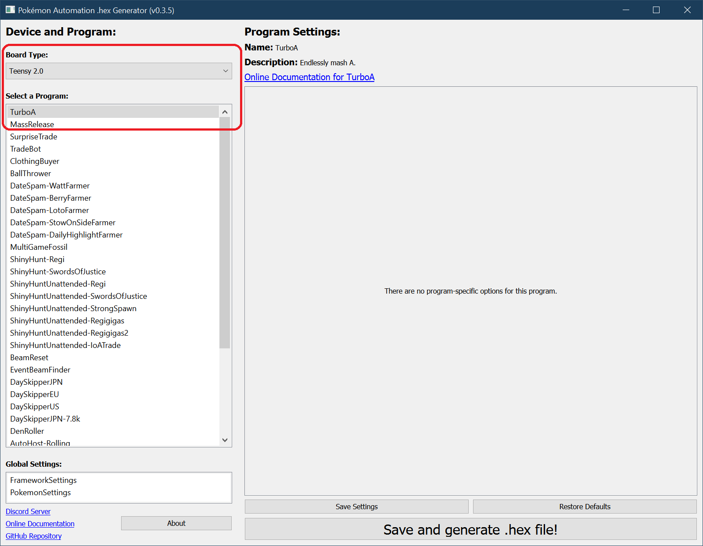
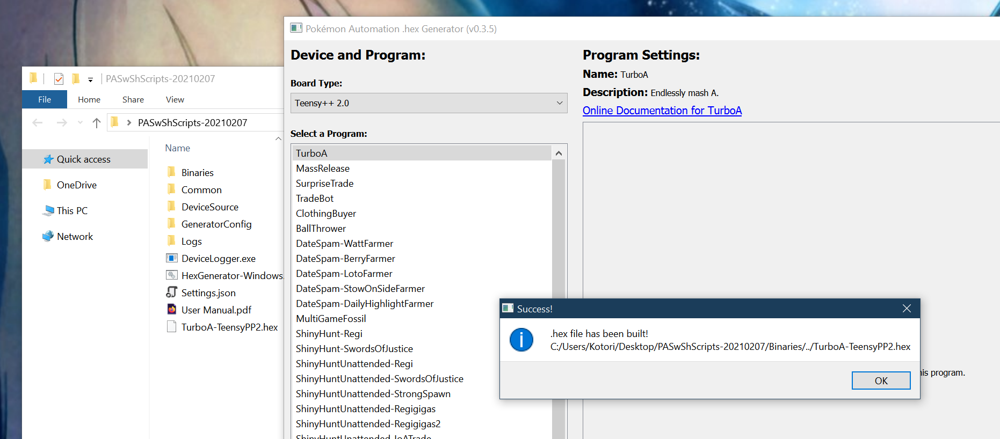
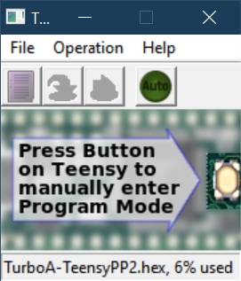
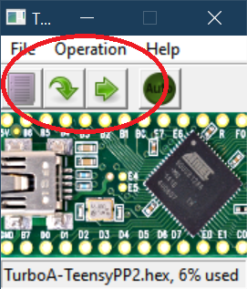

# Microcontroller Setup: Teensy 2.0 and Teensy++ 2.0 (Windows)

This section will walk you through the entire process of setting up your Teensy 2.0 or Teensy++ 2.0 on a Windows computer.

The Teensy 2.0 and Teensy++ 2.0 has been discontinued. Therefore we no longer recommend it. This guide is only if you already have a Teensy and need a refresher on how to set it up again.

## Hardware:

**Required Hardware (Full List):**
1. A Nintendo Switch.
2. A computer running Windows.
3. A [Teensy 2.0](https://www.pjrc.com/store/teensy.html) or [Teensy++ 2.0](https://www.pjrc.com/store/teensypp.html).
4. USB A to mini USB cable

### Recommended Purchase Links:

**Teensy 2.0 or Teensy++ 2.0:**

Product has been discontinued.

**USB A to mini USB cable:**

You should already have this from prior Teensy automation.

## Step 1: Install WinAVR

Download and install [WinAVR](https://sourceforge.net/projects/winavr/files/).

It is strongly recommended to install it in the default directory (`C:/WinAVR-20100110`).

## Step 2: Download Teensy Loader

Download [Teensy Loader](https://www.pjrc.com/teensy/loader.html).

Direct download link: https://www.pjrc.com/teensy/teensy.exe

## Step 3: Download the Arduino Programs

1. Download the latest version of our Arduino programs from [here](https://github.com/PokemonAutomation/Microcontroller/releases).

   * (The link should look like something like `PA-NativePrograms-0.x.x-xxxxxxxx.zip`)

   * If you get a virus or malware warning, ignore it. These are known false positives. If you don't trust us, the [source code is here](https://github.com/PokemonAutomation/Arduino-Source/tree/main/HexGenerator).

2. Once you have downloaded the package, unzip to somewhere you can access later. Do not put it on Microsoft OneDrive.

## Step 4: Generate a .hex file.

1. Open the (unzipped) package from previous step and double-click on `HexGenerator-Windows.cmd` to run it.
2. In the "Board Type" drop-down, change it to "Teensy 2.0" or "Teensy++ 2.0" depending on which one you have.
3. In the program list, click on "Turbo A".
> We recommend starting with "Turbo A"  as it is the simplest program. If you are able to get this running, it is easier to troubleshoot the other programs.

4. Click on "Save and generate .hex file!".

After a while, you should get a confirmation box saying it was successful. You should now see a file `TurboA-Teensyxxx.hex` in the folder of the programs.

## Step 5: Flash the .hex into the Teensy.

1. Run the Teensy Loader program that you downloaded earlier.
2. Click the purple file icon and browse for the .hex that was created in the previous step.

3. Plug the Teensy into your computer.
4. Press the white button on the Teensy. You may need to wait for Windows to install drivers.

At this point, two green arrows should show up in Teensy Loader.

5. Click the left arrow. This flashes the program into the Teensy.

6. Unplug the Teensy from your computer.

## Step 6: Setup and run the program!

1. On your Switch, enter the game and navigate to somewhere you want to mash A in front of (such as the digging duo).

2. Navigate to the grip menu without closing the game. This disconnects all controllers from the Switch so that the Teensy can take over.

3. Plug the Arduino into your Switch (or the dock that's attached to it).

The program should now begin running. It will flash its light for a few seconds, then it will connect to the Switch and navigate its way back into the game. After a brief pause, it will start mashing A.

**Usage Notes:**

- To stop the program, simply unplug the Teensy at any time.
- Do not change video output or mess with the HDMI. These can cause the program to Switch to freeze for multiple seconds and break the program. If you want turn off the TV, do it *before* you start the program.

## Other Programs

You now know how to run TurboA - the most basic of the programs. You can choose any of the other programs and repeat steps 4-6.

- [Program List](https://github.com/PokemonAutomation/Microcontroller/blob/master/Wiki/Programs/README.md)

It is important to read the manual for a program before you use it. Each program has a different set of instructions and startup conditions.
You can find the manual for a program by clicking on the "Online Documentation" link.

**Discord Server:** 

